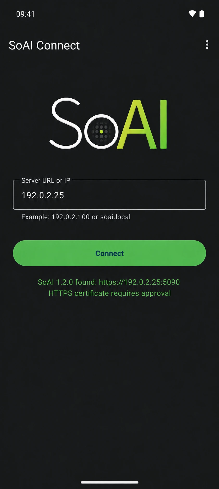

<p align="center">
<picture>
<source media="(prefers-color-scheme: dark)" srcset="media/readme/soai-wordmark-dark.webp">
<source media="(prefers-color-scheme: light)" srcset="media/readme/soai-wordmark-light.webp">

</picture>
</p>

<h1 align="center">SoAI Connect for Android</h1>

SoAI Connect is the official Android app for [SoAI](https://soai.to), the Smart Orchestrator for Artificial Intelligence.

<p align="center">
<a href="https://github.com/GetSoAI/SoAI_Connect"></a>


<a href="LICENSE.md"></a>
</p>

<p align="center">

</p>

SoAI runs on your own machine. This app puts it on your phone: the same chat, models, files, and automations you already use in the browser, served by your own server, reached directly over your network.

It also does two things a browser tab cannot. SoAI alerts reach your Android notification shade while the app sits in the background, so you know when an agent is waiting on you. And you can switch the machine on from your phone before you start.

You need a running SoAI server to use the app. Your data stays on it. SoAI Connect keeps your server address, your sign-in, and whatever the page view caches while you use it, which Incognito Mode wipes when you leave.

## What it does

You reach the server by address. Give the app a hostname or an IP and it checks the small range of ports a SoAI instance answers on, reads back which instance is there and which port its interface runs on, then shows you that before it connects. A server that had to fall back to a secondary port says so. If two instances answer, the app asks you for a port rather than picking one.

You decide which certificate to trust. Most self-hosted servers run HTTPS with a certificate no phone will accept on its own, and the usual workaround is to stop checking. This app shows you the subject, the issuer, and the SHA-256 fingerprint, and you trust it for one session or for good. What you trust is pinned to that server. If a different certificate shows up later, the session stops and the app asks you again, because a quiet swap is what interception looks like. Over plain HTTP to an address outside your local network, the app tells you the session is readable on the way.

Notifications come from your own server. No push provider sits in the path and no Google account is involved: the app holds the connection itself and turns what SoAI sends into Android notifications, whether that is a tool waiting for approval, an agent's question, a request for a secret, an automation that finished or failed, new mail, or a calendar reminder. The price of that design is battery management, since Android puts background connections to sleep, and the fix is the one setting described under Using the app.

Smaller things: camera, microphone, and file uploads go through the normal Android permission prompts. Incognito Mode clears cookies and site data when you leave. Logout ends the session on the server rather than only on the phone, and tells you when it could not reach it. Wake-on-LAN can target a custom broadcast address and port. The interface ships in 25 languages and follows your system's dark theme.

## Requirements

- Android 8.0 (API 26) or newer.
- A SoAI server reachable from the device over HTTP or HTTPS.

## Installing

SoAI Connect is distributed by sideloading from the Releases section of the [SoAI Connect repository](https://github.com/GetSoAI/SoAI_Connect). There is no app-store listing.

Each published APK ships with a `.sha256` sidecar and uses the canonical version-bearing name `SoAI-Connect-<version>-android.apk`. Verify the checksum and the signing certificate before you install:

```sh
sha256sum -c SoAI-Connect-<version>-android.apk.sha256
apksigner verify --print-certs SoAI-Connect-<version>-android.apk
```

A genuine package is signed with APK Signature Scheme v2 and v3, carries no v1 JAR signature, and reports this certificate:

```
Signer: CN=SoAI Connect, O=SoAI, L=Rome, C=IT
SHA-256 digest: 664ee2c1ce55db7179eafab41ff22585380e236e1a8163a50e273e4691b6990b
```

A package that fails either check did not come from this project. Report it instead of installing it.

## Using the app

**First connection.** Type your server's address, a hostname or an IP, and tap **Check**. The app finds the port by itself, so you rarely need to give one; add `:port` if you run more than one instance on the same machine. When it reports the server it found, tap **Connect**, then sign in with your SoAI account. After that the app opens straight to your server.

If your server uses HTTPS with its own certificate, the app shows you the certificate before it connects. Compare the SHA-256 fingerprint with the one on your server, then choose **Trust always**. The app remembers it, and if that certificate ever changes it stops and warns you before anything loads.

**Day to day.** The screen is your SoAI interface, working as it does in a browser. Camera, microphone, and file uploads ask for Android permission the first time you use them. The toolbar menu holds **Reload**, **Settings**, and **About**.

**Turning on notifications.** Open **Settings → Privacy** and switch on **Android Notifications**, then allow the notification permission when Android asks. Because the app keeps its own connection to your server rather than going through Google, Android will eventually sleep it to save battery: find SoAI in your battery settings and set it to unrestricted. Name the device in the same section if you want the server's session list to be readable at a glance.

**Waking the machine.** Under **Settings → Power**, enter the MAC address of the machine running SoAI and tap **Wake now**. Enable Wake-on-LAN in that machine's BIOS and operating system first, or the packet arrives with nothing listening for it.

**Starting over.** **Settings → Data** holds **Clear Cache**, **Logout**, which ends the session on the server as well as on the phone, and **Change server**, which forgets the current server and returns you to the setup screen. To drop a trusted certificate without leaving the server, use **Reset Trusted Certificate** under **Settings → Security**.

## Building from source

You need JDK 17 or newer and an Android SDK with platform 37 and a matching build-tools package. Point `sdk.dir` in `android/local.properties` at your SDK.

```sh
cd android
./gradlew :app:test
./gradlew :app:lint
./gradlew :app:assembleDebug
```

Debug builds need no signing material. A release build is signed with the project's own key and is refused without it, so `:app:assembleRelease` only works for the maintainer. To build a signed release of your own fork, supply your own keystore in `android/local.properties`:

```properties
sdk.dir=/path/to/android-sdk
soai.release.storeFile=your-release.keystore
soai.release.storePassword=...
soai.release.keyAlias=...
soai.release.keyPassword=...
```

That file holds signing secrets and is never tracked in git. Keep the keystore outside the checkout, readable only by you, and back it up. An Android package can only be updated in place by a build signed with the same key.

## Versioning

`VERSION` holds the client version and is the only place it is written. SoAI Connect versions independently of the SoAI server. It is a companion artifact, never an input to SoAI's automatic updates, and a client fix does not require a server release.

`versionCode` is derived from that version as `major * 10000 + minor * 100 + patch`, so `1.2.3` is `10203`. Bumping `VERSION` is the whole release-version change. Minor and patch components must stay below 100.

## Layout

| Path | Contents |
| --- | --- |
| `android/` | The Gradle project. Application sources are under `android/app/src/main/kotlin/com/soai/android/`. |
| `licenses/` | Third-party notices for every component embedded in the package. |
| `VERSION` | The client version. |
| `LICENSE.md` | The MIT License covering this client. |

## Third-party components

`licenses/ANDROID-THIRD-PARTY-LICENSES.txt` records every component embedded in the package, with its license text. The same notice is reproduced inside the app under **About → Licenses**. It is regenerated from the resolved release dependency graph whenever a release is built.

## License

SoAI Connect is licensed under the MIT License; see `LICENSE.md`. You may inspect, copy, modify, and redistribute it, including as the basis for your own client.

That grant covers this client only. It conveys no right in the SoAI name, logos, or product identity, and no right to run, copy, or distribute SoAI itself. Connecting a client to a SoAI deployment still requires rights applicable to that deployment. SoAI is distributed under the SoAI Source-Available License 1.0; see the downloads section of [soai.to](https://soai.to).

Third-party Android libraries remain governed by their own licenses and notices.

## Issues, security, and contributions

Bug reports and feature requests are welcome through the Issues section of the [SoAI Connect repository](https://github.com/GetSoAI/SoAI_Connect). Include the client version, the Android version, and what you did, what happened, and what you expected.

Never report a security vulnerability in a public issue. `SECURITY.md` sets out the single point of contact and the disclosure process.

Pull requests are not accepted. `CONTRIBUTING.md` explains why, and what is welcome instead.
